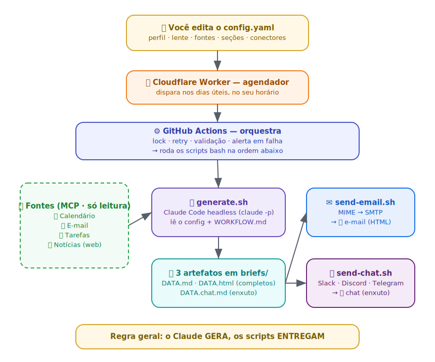

# brief-diario (template)

Template genérico para automatizar um **brief matinal** entregue por e-mail e chat. Todo dia, no horário que você definir, o **Claude Code** (headless) gera um panorama do
seu dia:

-  📅 agenda 
-  📧 e-mails 
-  ✅ tarefas
-  📰 notícias
-  🎯 síntese
-  💼 sugestões de conteúdo para redes sociais (opcional)

**Scripts determinísticos** entregam por e-mail (HTML) e num canal de chat (Slack/Discord/Telegram). Serverless: roda no **GitHub Actions**, disparado por um **Cloudflare Worker**.

Tudo é configurável num único **`config.yaml`**: seu perfil, a lente de relevância, as fontes de notícia, quais seções ligar e quais conectores usar. Sem editar código.

> **Regra geral: geração ≠ entrega:** o Claude **só gera arquivos**; nunca envia e-mail nem posta no chat. Toda entrega é dos scripts, reforçada por permissões e hooks.

## Como funciona (visão geral)



Da esquerda para a direita, de cima para baixo:

1. **Você edita o `config.yaml`** — quem você é, o que é relevante, quais seções e conectores quer. É o único arquivo que você precisa mexer.
2. **O Cloudflare Worker dispara** o pipeline no horário, nos dias úteis.
3. **O GitHub Actions orquestra** (lock, retry, validação, alerta) e roda os scripts.
4. **O `generate.sh` chama o Claude headless**, que lê o seu perfil + o `WORKFLOW.md`, consulta suas **fontes** (calendário, e-mail, tarefas via MCP; notícias na web) e **grava 3 artefatos**: `.md` e `.html` completos + `.chat.md` enxuto.
5. **Os scripts entregam**: `send-email.sh` manda o e-mail; `send-chat.sh` posta no Slack/Discord/Telegram. O Claude nunca entrega.

> Diagrama editável (Excalidraw): [docs/arquitetura.excalidraw](docs/arquitetura.excalidraw) - abra em [excalidraw.com](https://excalidraw.com).

## Pré-requisitos

Dependem do que você vai fazer:

**1. Configurar e validar — qualquer SO (Windows, macOS, Linux)**
- **Node ≥ 20** — é só o que o wizard (`npm run setup`) e o validador (`npm run doctor`) precisam.

**2. Gerar e enviar o brief localmente** (opcional; é o mesmo que o GitHub Actions roda)
- `bash`, `jq`, `curl`, `python3 + PyYAML` (`pip install pyyaml`) e o **Claude Code** CLI (`claude -p` com `CLAUDE_CODE_OAUTH_TOKEN` de `claude setup-token`).
- Nativo no Linux/macOS. **No Windows, rode via WSL ou Git Bash** (os scripts de geração/envio são bash).

**3. Produção (serverless)**
- Conta **GitHub** (Actions) e conta **Cloudflare** (agendador) — ambiente Linux gerenciado, nada a instalar.
- Credenciais dos conectores que escolher: SMTP (e-mail), MCP de tarefas/calendário/e-mail, webhook do chat.

## Passo a passo

1. **Use este repositório como template** no GitHub (botão *Use this template*) ou clone-o.

2. **Rode o wizard de configuração** — Windows, macOS ou Linux:
   ```bash
   npm install
   npm run setup
   ```
   Ele faz algumas perguntas e gera o `config.yaml` e o `.env` (já com as chaves certas, vazias). Ao final, valida com o doctor.

3. **Preencha os segredos no `.env`** (token do Claude, SMTP, webhook do chat) e valide quando quiser — também cross-platform:
   ```bash
   npm run doctor        # rode até dar tudo ✓
   ```
   Referência de cada campo: [CONFIG.md](CONFIG.md). Segredos por conector: [CONNECTORS.md](CONNECTORS.md).

   <details>
   <summary>Prefere configurar à mão, sem o wizard?</summary>

   ```bash
   cp config.example.yaml config.yaml      # gitignored
   cp .env.example .env                     # no Linux/macOS: chmod 600 .env
   # edite os dois e depois rode: npm run doctor
   ```
   </details>

4. **(Opcional) Conectores MCP** (tarefas/calendário/e-mail), se usar:
   ```bash
   cp mcp-servers.example.json mcp-servers.json
   # deixe só os que usa; autorize cada um uma vez localmente — ver SETUP.md
   ```

5. **(Linux/macOS/WSL) Gere e teste localmente:**
   ```bash
   scripts/generate.sh $(date +%F)      # gera briefs/AAAA-MM-DD.{md,html,chat.md}
   MAIL_METHOD=stdout scripts/send-email.sh $(date +%F) | head -40   # inspeciona o MIME
   scripts/send-email.sh $(date +%F)                                 # envia de verdade
   scripts/send-chat.sh  $(date +%F)                                 # posta no chat
   ```
   > No **Windows**, rode esta etapa dentro do **WSL** ou **Git Bash** (os scripts são bash). Configurar/validar (passos 2–3) não precisa disso.

6. **Coloque em produção** (GitHub Actions + agendador): cadastre os GitHub Secrets, ative o workflow e faça o deploy do Cloudflare Worker — runbook completo em [SETUP.md](SETUP.md).

   > ⚠️ **O workflow vem desabilitado por padrão.** Assim ele não fica falhando antes de você cadastrar os secrets. Depois de configurar tudo, habilite-o em **Actions → brief-diario → Enable workflow** (ou `gh workflow enable brief-diario`).

## Artefatos gerados

| Arquivo               | Conteúdo                               | Uso                   |
| --------------------- | -------------------------------------- | --------------------- |
| `briefs/DATA.md`      | Brief completo (Markdown)              | parte texto do e-mail |
| `briefs/DATA.html`    | Brief completo (HTML standalone)       | corpo do e-mail       |
| `briefs/DATA.chat.md` | Versão enxuta (Agenda/Tarefas/Síntese) | post no chat          |

## Personalizar e estender

- **Conteúdo do brief:** edite [WORKFLOW.md](WORKFLOW.md) (a spec do prompt) — mas a maior parte do dia a dia se ajusta só pelo `config.yaml`.
- **Trocar de provedor de e-mail / chat / MCP, ou adicionar uma fonte nova:** [CONNECTORS.md](CONNECTORS.md).

## Documentação

- **[CONFIG.md](CONFIG.md)** — referência de cada campo do `config.yaml`.
- **[SETUP.md](SETUP.md)** — credenciais, MCPs, GitHub Secrets e agendador.
- **[CONNECTORS.md](CONNECTORS.md)** — conectores suportados e como estender.
- **[WORKFLOW.md](WORKFLOW.md)** — a spec do conteúdo do brief.
- **[scheduler/](scheduler/)** — o Cloudflare Worker que dispara o brief.

Testes: `npm test` (wizard + validador, cross-platform) e os testes dos scripts bash (`scripts/lib/test_config.py`, `scripts/test_send_chat.sh`). Sem build nem lint.
